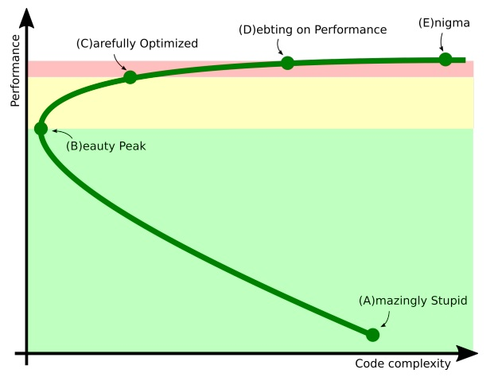

### Joker notes

#### Кейноут. Перформанс от Шипилёва.

Доклад понятный и захватывающий, а не технический, как и положено кейноуту.
[Слайды](https://shipilev.net/talks/joker-Oct2016-perf-keynote.pdf)

Официально разрешили использовать :) (с оговорками, есессно)

``` java
val start = getTimeMillis()
foo()
val time = getTimeMillis() - start
```

Алексей показал занятный график - shipilёv optimization curve.


Смысл графика в том, что есть 3 зоны оптимизации проекта:

- Зеленая. Зона в которой фактически всё работает неоптимально только из-за кривых рук или решений. В ней логичными и идеологически правильными исправлениями можно добиться ускорения. Тут мы можем использовать *любые* метрики и инструменты производительности уровня приложения.

- Желтая. В этой зоне у нас хороший код. Хочется быстрее? Нужно помнить Закон Амдала (нет предела в ухудшении производительности). Нужно иметь перформанс тестирование, много времени и денег. В перф тестировании нужно уметь работать с метриками. Нужно иметь правдоподобную модель работы приложения в тестах. Берем все эти средства, садимся, придумываем оптимизации в длительном регрессе.

- Красная. *Эту зону мы не будем вам показывать.* Грязные хаки, эксплуатация нижних слоев приложения. 

#### Мифы о Spark, или Может ли пользоваться Spark обычный Java-разработчик.
Практическая сессия от Евгения Борисова. 

Spark for Scala. Теперь это не так. Хотя раньше я тоже так думал. 
Теперь Spark Java-friendly. Это значит, что java api будет максимально близким к scala api и появляться с незначительными задержками.

Spark runs everywhere. Можено использовать с Hadoop, Mesos, в облаке и в standalone.

Было показано как удобно использовать Spark стримы. Они синтаксически близки к стримам java 8, только выполняются распределенно.
Spring и Spark можно подружить - это выглядит круто. Подводные камни наверняка есть, но попробоавть Spark точно стоит.
Сейчас уже есть версия 2.0x, но пока сыровата.

Вот пример, на java 7 выглядело бы неприятно.
``` java
// sc - spark context
JavaRDD<String> lines = sc.textFile("hdfs://log.txt")
                          .filter(s -> s.contains("error"));
```  

#### Эффективная работа c IDEA
Не впервые слушаю доклад с подобным названием. Прикладной, полезный.
Перефигачил себе большую часть настроек после доклада. Программировал в idea около 24 часов с тех пор - доволен.
Что сделал:

1. Убрал все боковые табы, кроме таба проекта.
2. Убрал главнуб панель сверху.
3. Оставил себе 1 таб с кодом, запретил открывать другие.
4. Убрал название этого таба с кодом.
5. Изменил ширину панельки с номерами строк.
6. Сделал follow сode file в табе проекта.
7. Убрал синеву из цветов
8. Начал пользоваться чиловыми метками в коде

Практически перестал пользоваться трекпадом. Перестал напрягаться на 13-дюймовом мониторе.

#### Контейнер не нужен: Современный Java Stack с Bootique.io
Какой-то около-маркетинговый доклад вышел. (Посмотрел минут 15 и переключил трек) 
Для себя вынес то, что порог вхождения выше, чем у Spring Boot, а профит не виден. Достаточно сырой еще продукт.

#### Причуды Stream API
Интересно было послушать. Раньше сталкивался с одной из озвученных проблем:
``` java 
val collection = sorted data collection
	collection.stream()
		.boxed()
		.sorted()
		.terminalOp()
```
Стрим ничего не знает об упорядоченности данных внутри. Ему стоит об этом скаказть. Кроме того, операция `boxed()` снимет со стрима флаг упорядоченности, такие дела.

`IntStream::distinct` реализован *интересно*, через переход к объектному стриму. Это добавляет работы. Хотя стоило бы ожидать, что `IntStream::distinct` работает быстрее, чем `Stream<Integer>::distinct`

#### Близкие Контакты JMM-степени
JMM от Шипилёва
Технически насыщенный доклад с хорошей демонстрацией подхода к анализу многопоточного кода.
Без знания hb-нотаций смотреть особо смысла не будет.
Доклад понятный.
Главные правила - safe publication - наше всё и не уверен - поставь синхронизацию.

#### Будьте готовы к G1 GC, или Эволюция G1 GC
G1 - default GC java 9. Но не для всех он подходит.
Господа из RTB рассказывали о своей методике выбора GC в проекте.
[Статья на хабре.](https://habrahabr.ru/company/getintent/blog/302910/)
Взяли G1 и CMS, сделали тюнинг для своей модели. Потестили - на результаты интересно взглянуть.
Несколько интересных флажков jvm.

Хорошо прослеживается путь проб и ошибок, который в итоге привел к получению внятной метрики для их проекта. (Или не привел, а они себя в этом убедили)

#### Vert.x: Красавица и Чудовище
Владимир Красильщик.

Лучший трек, на мой взгляд. 
Vert.x - это технология, на которую стоит посмотреть в действии.
Достаточно легко можно увязать js, jRuby и java в одном кластере.
Еще были рассмотрены утилиты для тестирования респределенного кластера.
Материалы пересекающиеся с докладом: [раз](https://www.youtube.com/watch?v=JRFwicUlwyI), [два](https://www.youtube.com/watch?v=xPx3UHF9ccQ).


#### Введение в распределенные системы для очень занятого джависта
Многое слов про CAP и около СAP. Доклад уровня студентов младших курсов. Была парочка деталей характерных для Hazelcast
Мало технических деталей.
