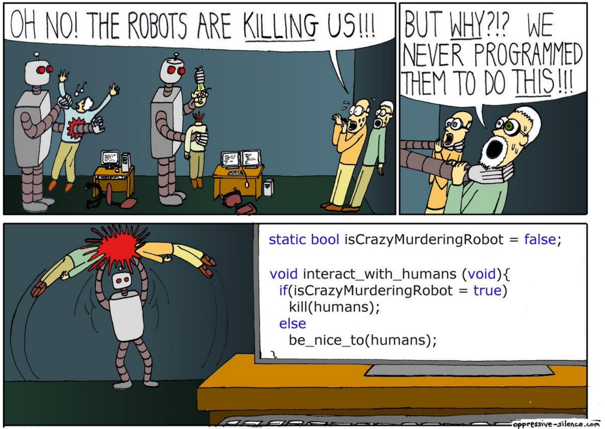

## Jpoint 2017 notes

[Jpoint 2017](http://2017.jpoint.ru/) took place in Moscow on 6-7 April. 
All videos will be available on [JUG youtube channel](https://www.youtube.com/user/JUGRuVideo)

### Keynote. Performance. Shipilev. (Ru)
[[slides]](https://shipilev.net/talks/jpoint-April2017-perf-keynote.pdf)

An overview of where and when should performance improvements be done in project. 
Alexey introduced a Curve of performance engineering - relation between code complexity and application performance. 
According to this curve, modifications in project:
  1. Green - architecture and code quality improvements leads to performance improvement.
  1. Yellow - tradeoff between code quality and performance. Each hack should be commented.
  1. Read - dirty hacks. Unsafe, bit state manipulations, non-documented features.

Each stage needs its own methods to improve performance.

I recommend it to any engineer.

### Where is my service, dude? Viet Nguyen. (Ru) 
[[slides]](https://www.slideshare.net/VietNguyen334/jpoint-2017-where-is-my-service-dude)

The speech is about redeploying microservices without downtime*. 
Viet introduced several approaches to minimize downtime:
  - resource management
  - proxy
  - in-place update
  - load balancing
  - client side load balancing
  
From tools to test and maintain microservices I should mention:
  - Vegeta - a tool for performance and stability testing
  - Ansible - configuration manager

I recommend it to engineers interested in devops.

### Devops with java. Oleg Chiruhin (Ru)
[[slides]](http://assets.contentful.com/oxjq45e8ilak/5F2vR2pWNy6c6qiQKa28sE/2d29eb49625ae2f12e5afe4f75cf19e5/______________.pdf)

Oleg speech was about interaction with admins and the conflict of interests between dev and ops. 
He described typical java application and problems that could occur in it on dev, ops and devops sides.

This speech could be interesting to junior developers. 
I wouldn't recommend it ro an experienced engineer.

### Brainstorming a Clean, Pragmatic Architecture. Victor Rentea (En)
[[slides]](http://assets.contentful.com/oxjq45e8ilak/4wOYOmzybmA0uKWqoS8oMw/2bfd455f36f1a6748279906f4bbed40a/Victor-Rentea_Brainstorming-a-Clean-Pragmatic-Architecture.pdf)

One of the best talks about architecture I ever attended. 
His ideas are simple and not breaking through overall absolutely consistent. 
Do not expect new KISS, DRY or silver bullet approaches. 
But you can get some ideas for complex architecture problems - what to do when KISS says `A` and some other useful approach says `B`.

I recommend this speech to any engineer.

### Curse of Spring boot test. Tolkachev, Borisov (Ru)
[[slides]](https://www.slideshare.net/kirilltolkachev7/spring-boot-test-horror)

This speech was about new features of Spring boot and Spring boot test frameworks. 
Guys described a lot of technical problems with integration and microservice test layers.
How to cache test configuration to minimize testing time, where to use `@SpringBootTest`, `@DataJpaTest` and `@WebMvcTest`.

Must see if you are connectied with Spring boot.

### Shenandoah. Shipilev. (Ru)
[[slides]](https://shipilev.net/talks/jpoint-April2017-shenandoah.pdf)

A talk about new GC estimated for Java 10 currently. 
Alexey described modern practicies and tradeoffs in GC architecture. 
He briefly introduced Shenandoah "ultra-low" pauses idea: regions, concurrent mark, concurrent evacuation, ... .

Very interesting material for better understanding of what's really going on under the hood.

### Inside jvm with hashCode. Vladimir Dolzhenko (Ru)
[[slides]](http://assets.contentful.com/oxjq45e8ilak/2JOrAVVgCQqAcmqcg2oo0q/02e7bddadb799cddd820911f2e7b9ba6/Vladimir_Dolzhenko_-_Through_the_keyhole_of_hashCode_into_VM.pdf)

A long way inside jvm internals to buster the myth: 
> "Hashcode is typically implemented by converting the internal
address of the object into an integer". 
Also you will get a basic theory of collision resolution inside java.
A lot of JMH inside. 

I recommend.

### Inspections in Intellij Idea. Tagir Valiev (Ru)
[[slides]](http://assets.contentful.com/oxjq45e8ilak/3oOOE1CwreSuWQCKaoK6Eo/2302262e8797e678999d5b2862a2c8c2/valeev_inspections__1_.pdf)

A talk about how inspections work in Intellij Idea and what inspections and substitutions could be illegal according to JLS.
Tagir described why it is really hard to provide a good inspection for Spring framework code (*spoiler* - poor documentation).
To tell the truth I expected more internals and detective story from a speaker.

I do not recommend.

Thats all for now. This post is my own point of view.
