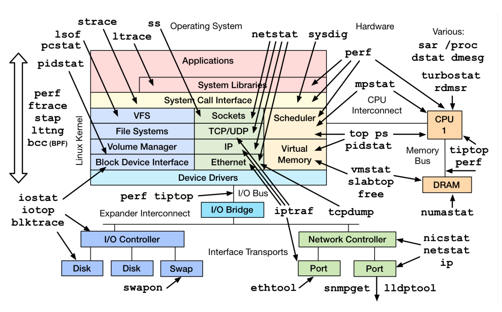

## Jpoint 2017 notes

[Jpoint 2017](http://2017.jpoint.ru/) took place in Moscow on 6-7 April.

### Keynote. Performance. Shipilev. (Ru)
[[slides]](https://shipilev.net/talks/jpoint-April2017-perf-keynote.pdf)

An overview of where and when should performance improvements be done in project. 
He introduced a Curve of performance engineering - relation between code complexity and application performance. 
According to this curve each project could be on one of three stages. 
Each stage needs it's own methods to improve performance.

I could recommend to any engineer.

### Where is my service, dude? Viet Nguyen. (Ru) 
[[slides]](https://www.slideshare.net/VietNguyen334/jpoint-2017-where-is-my-service-dude)

This speech is about redeploying microservices without downtime*. 
Viet introduced approaches and tools to minimize downtime:
  - resource management
  - proxy
  - in-place update
  - load balancing
  - client side load balancing
  
From tools I should mention Vegeta - a tool for performance and stability testing and Ansible - configuration manager.

I could recommend to engineers interested in devops.

### Devops with java. Oleg Chiruhin (Ru)
[[slides]](http://assets.contentful.com/oxjq45e8ilak/5F2vR2pWNy6c6qiQKa28sE/2d29eb49625ae2f12e5afe4f75cf19e5/______________.pdf)

Oleg speech was about interacting with admins, and the conflict of interests between dev and ops. 
He described typical java application and problems that could occur in it on dev, ops and devops sides.

This speech could be interesting to junior developers. I do not want to recommend it.

### Brainstorming a Clean, Pragmatic Architecture. Victor Rentea (En)
[[slides]](http://assets.contentful.com/oxjq45e8ilak/4wOYOmzybmA0uKWqoS8oMw/2bfd455f36f1a6748279906f4bbed40a/Victor-Rentea_Brainstorming-a-Clean-Pragmatic-Architecture.pdf)

One of the best talks about architecture I ever attended. 
His ideas are simple and not breaking through but absolutely consistent in total. 
Do not demand to get new KISS, DRY or silver bullet approaches. 
But you can get ideas for complex architecture problems - what to do when KISS says `A` and some other useful approach says `B`.
I can recommend this speech to any engineer.
